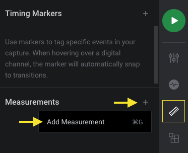

# HummingBird Automated Electrical Test for I2C Signal
  
An extension that check whether the captured analog measurements meet I2C SPEC limitation.

SPEC reference:	[NXP UM10204](https://www.nxp.com/docs/en/user-guide/UM10204.pdf)

A report html file would be generated at under tmp folder,
for example, /tmp/output_reports/report_20210824150025.html

Capture both SCL and SDA data so that all SPEC limitation could be tested.

The captured data should include START or RESTART pattern.

Support SPEC | definition
----------------- | ------------------
v_nl | noise margin at the LOW level
v_nh | noise margin at the HIGH level
t_rise | signal rise time
t_fall | signal rise time
t_low | LOW period of the SCL clock
t_high | HIGH period of the SCL clock
f_clk | SCL clock frequency
t_SU_DAT | data set-up time
t_HD_DAT | data hold time, from the falling edge of SCL
t_HD_STA | hold time (repeated) START condition
t_SU_STA | set-up time for a repeated START condition
t_SU_STO | set-up time for STOP condition
t_BUF | bus free time between a STOP and START condition

## Instructions
1. Install this extension by clicking "Install"
2. Add a measurement by clicking on the "Timing Markers & Measurements" on the right, then the Measurements "+" icon.

	

3. Drag the measurement selection window over your recorded data.
4. Both SDA and SCL data should be captured (both order would be fine) to check all SPEC limitation.
